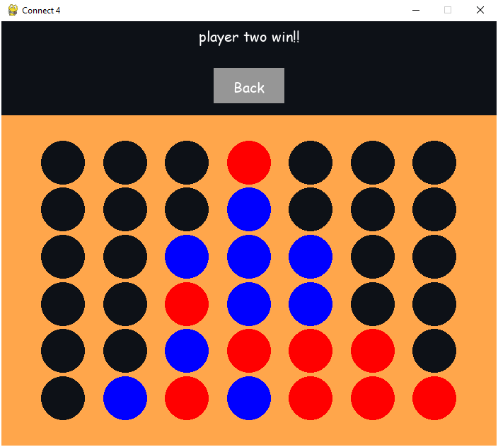
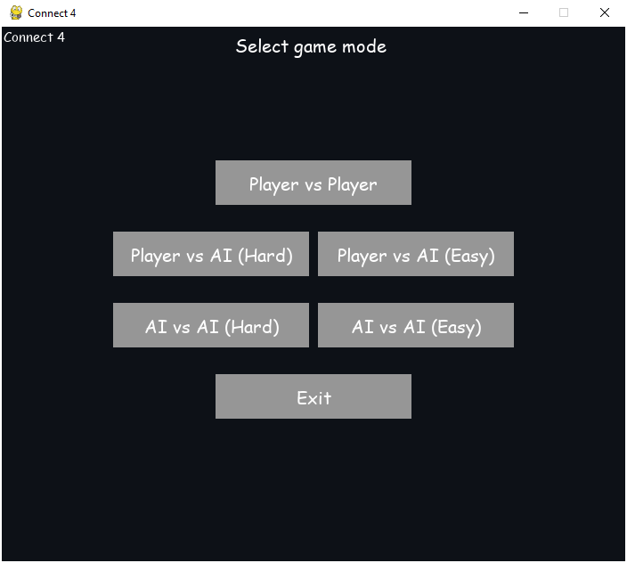

# Connect 4 Game 
Implementation of the classic game Connect 4 using Pygame from Pyhon , MinMax and Greedy algorithms. Connect 4 is a two-player strategy game played on a grid of 6 rows and 7 columns. (You can chnage number of rows and columns in code.)

    

## Features
- **Interactive Gameplay**
- **Play with any grid size**
- **Player vs Player**
- **Player vs AI Opponent** 
- **Hard Mode (AI with MinMax algorithm)** 
- **Easy Mode (AI with Greedy algorithm)**

## Usage
    python Connect_4.py

Note : Player one color is red and Player two color is blue.